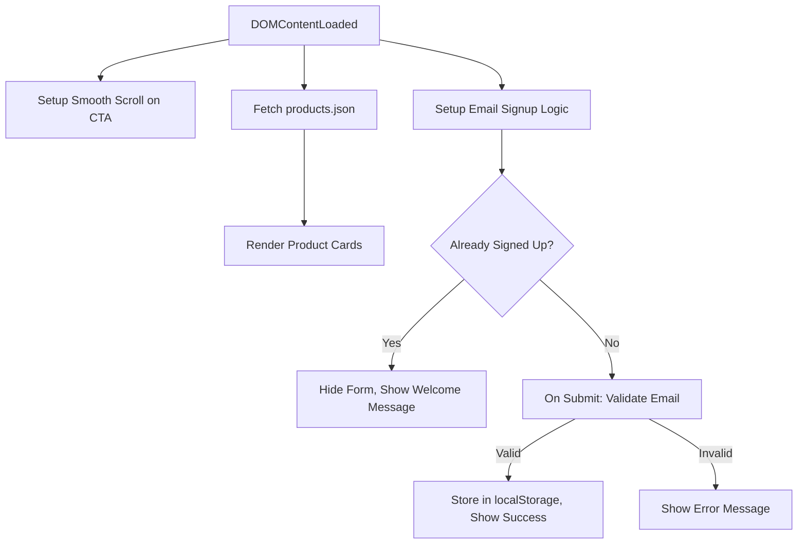

# 🧵 NEUTRL SPACE

**Minimalism meets meaning.**  
A fashion-forward, editorial-grade storefront built in New York for timeless digital expression.

---

## 🚀 Build & Run Instructions

To run the project locally:

```bash
git clone https://github.com/KESNIAABRAHAM/Neutrl-Space.git
cd Neutrl-Space
open index.html


# 🧵 NEUTRL SPACE

**Minimalism meets meaning.**  
A fashion-forward, editorial-grade # Neutrl Space Codebase Documentation

Welcome to the documentation for the Neutrl Space storefront! This codebase is a modern, responsive, and accessible ecommerce front-end. It features interactive UI, dynamic product rendering from JSON, smooth scrolling, and a persistent email signup experience. Below you'll find detailed explanations for every file, design decisions, accessibility strategies, and suggestions for Shopify integration.

---

## `index.html`

The **main HTML file** defines the website structure, including navigation, hero section, editorial content, dynamic product grid, and email signup.

### Key Sections

- **Header & Navbar:**  
  Fixed navigation bar with logo and icon buttons for cart, search, and profile.
- **Hero Section:**  
  Full-screen video background, headline, subheadline, and call-to-action button.
- **Editorial Section:**  
  Brand philosophy, editorial headline, and supporting image.
- **Product Grid:**  
  Container for dynamically-rendered product cards (populated by JS).
- **Email Signup:**  
  Form for users to subscribe to the newsletter, enhanced with error/success feedback.

### Accessibility & Performance Features

- Uses semantic HTML elements (`<header>`, `<nav>`, `<main>`, `<section>`, `<form>`, etc.) for SEO and accessibility.
- All images and videos include `alt` and `loading="lazy"` attributes for a11y and performance.
- Button elements are used for interactive controls, with `aria-label` for screen reader clarity.
- CSS and JS are external for improved caching and maintainability.

### Example Structure

```html
<header>
  <nav class="navbar">
    <!-- Navigation buttons and site title -->
  </nav>
</header>
<section class="hero" id="scroll">
  <!-- Video, headline, CTA button -->
</section>
<main>
  <section class="editorial" id="editorial">
    <!-- Editorial content and image -->
  </section>
  <section class="product-grid" id="products-grid"></section>
  <section class="email-footer">
    <!-- Email signup form -->
  </section>
</main>
<script src="app.js"></script>
```

---

## `style.css`

This file defines the **visual design** and **responsive layout** using modern CSS.  
A consistent, minimal, and elegant aesthetic is achieved with custom fonts, colors, and adaptive grid layouts.

### Major Styles

- **Body & Typography:**  
  Uses system and serif fonts for clarity and brand tone.
- **Navbar:**  
  Fixed, dark bar with white text and SVG icons. Responsive and accessible.
- **Hero Section:**  
  Video background, headline, and a prominent CTA button with hover/focus effects.
- **Editorial Section:**  
  Flex layout adapts for screens, with styled images and text.
- **Product Grid:**  
  Responsive grid: 1–4 columns depending on screen width.
- **Product Cards:**  
  Hover swaps images, adds animated overlays, and features tags.
- **Email Capture:**  
  Clean form layout, with distinct styles for focus, error, and success states.

### Responsive Grid Example

```css
@media (min-width: 600px) {
  .product-grid { grid-template-columns: repeat(2, 1fr); }
}
@media (min-width: 900px) {
  .product-grid { grid-template-columns: repeat(3, 1fr); }
}
@media (min-width: 1200px) {
  .product-grid { grid-template-columns: repeat(4, 1fr); }
}
```

### Accessibility & Performance

- **Focus outlines** are visible for keyboard navigation.
- **Contrast ratios** ensure readability.
- **Lazy-loaded images** improve page speed.
- **Button and input hover/focus states** support usability.

---

## `products.json`

This file is a **static data source** for the products displayed on the site.  
It provides all necessary metadata for rendering product cards dynamically.

### Data Structure

Each product object includes:

| Field         | Type   | Description                                 |
|---------------|--------|---------------------------------------------|
| `title`       | String | Product name                                |
| `price`       | String | Price (formatted with currency symbol)      |
| `tag`         | String | Tag (e.g. "New", "Limited")                 |
| `primaryImage`| String | Path to main image                          |
| `secondaryImage`| String | Path to alternate image (for hover effect) |

### Example Product

```json
{
  "title": "TQuilted Hunting Hat",
  "price": "$320",
  "tag": "New",
  "primaryImage": "images/product1.jpeg",
  "secondaryImage": "images/product2.jpeg"
}
```

---

## `app.js`

This JavaScript file powers **site interactivity**, dynamic product rendering, smooth scroll, and email signup logic.

### Main Functionalities

- **Hero CTA Smooth Scroll**  
  The "Join The Reserve" button smoothly scrolls to the editorial section.
- **Dynamic Product Rendering**  
  Fetches `products.json` and creates product cards in the grid with images, hover overlays, and tags.
- **Email Signup Logic**  
  - Validates email format.
  - Persists signup state in `localStorage` to show success/welcome messages on future visits.
  - Provides real-time feedback for errors or successful signups.

### Code Flow Diagram



### Email Signup Validation

A simple RegExp checks for a valid email format. State is persisted in `localStorage`, providing a smooth user experience.

---

## 🛠️ Build/Run Instructions

1. **Clone or Download** the repository.
2. Place all files (`index.html`, `style.css`, `app.js`, `products.json`) in the same directory.  
   Ensure the `images/` and `data/` folders (with images and JSON) exist as referenced.
3. Open `index.html` in your browser.

**No server is required** unless you want to fetch `products.json` via HTTP (some browsers block local fetch).  
If needed, run a simple local server:

```bash
# Python 3
python -m http.server
# Node.js
npx serve .
```

---

## 📝 Design Decisions

- **JSON-Driven Product Rendering:**  
  Decouples product data from markup, making it easy to update and scale.
- **Lightweight Vanilla JS:**  
  No frameworks for faster loads and easier Shopify integration.
- **Focus on Accessibility:**  
  Keyboard-friendly, semantic HTML, high color contrast, ARIA labels.
- **Responsive Design:**  
  CSS grid and flexbox ensure beautiful layout on all screens.
- **Performance:**  
  Images are lazy-loaded, minimal JS, and styles are concise.

---

## ♿ Accessibility & Performance Choices

- **ARIA and alt attributes** for all images and icons.
- **Focus outlines** for all actionable controls.
- **Semantic headings and sectioning** for screen readers.
- **Color contrast** meets WCAG standards.
- **Optimized images** and lazy loading for quick page loads.
- **No heavy external libraries** for snappy UX.

---

## Shopify Liquid Snippet Integration

To bring this UI to a Shopify store, you would:

1. **Move the product card template** into a Liquid snippet (e.g., `product-card.liquid`).
2. **Replace JSON fetch** with Shopify’s built-in `for product in collection.products` Liquid loops.
3. **Adapt image paths and fields** to use Shopify’s product object (`product.featured_image`, `product.title`, etc.).
4. **Email capture** could be wired to Shopify’s built-in newsletter or an app endpoint.
5. **JS code** can remain mostly the same, just ensure that DOM selectors match new Liquid-generated markup.

### Example: Product Card as Liquid Snippet

```liquid
<div class="product-card">
  <div class="product-image">
    
    
      
    
    <div class="hover-text">ADD TO CART</div>
    <span class="product-tag">{{ product.tags.first }}</span>
  </div>
  <div class="product-info">
    <h3 class="product-title">{{ product.title }}</h3>
    <p class="product-price">{{ product.price | money }}</p>
  </div>
</div>
```

---

## 📦 Potential Package Managers Block

If you added dependencies, here's how you’d document installs (not needed for the current vanilla stack):

```packagemanagers
{
    "commands": {
        "npm": "npm install",
        "yarn": "yarn install",
        "pnpm": "pnpm install",
        "bun": "bun install"
    }
}
```

---

## 🚀 Summary Table

| File           | Purpose                                             | Highlights                     |
|----------------|-----------------------------------------------------|-------------------------------|
| `index.html`   | Main page layout & structure                        | Semantic, a11y, responsive    |
| `style.css`    | Visual design & responsive styles                   | Minimal, adaptive, focus state|
| `products.json`| Data source for products                            | Scalable, easy to update      |
| `app.js`       | Interactivity & dynamic rendering                   | Smooth scroll, email capture  |

---

## JSON API Endpoint Block

While this front-end fetches a local JSON file, in a real deployment you'd serve products from a backend API. Here’s how the endpoint would be documented:

```api
{
    "title": "Get All Products",
    "description": "Retrieve all product data for rendering on the storefront.",
    "method": "GET",
    "baseUrl": "https://neutrlspace.com",
    "endpoint": "/data/products.json",
    "headers": [],
    "queryParams": [],
    "pathParams": [],
    "bodyType": "none",
    "requestBody": "",
    "responses": {
        "200": {
            "description": "Success",
            "body": "[{\"title\":\"TQuilted Hunting Hat\",\"price\":\"$320\",\"tag\":\"New\",\"primaryImage\":\"images/product1.jpeg\",\"secondaryImage\":\"images/product2.jpeg\"}, ...]"
        },
        "404": {
            "description": "Not Found",
            "body": "{\"error\": {\"message\": \"Products not found\"}}"
        }
    }
}
```

---

## 🧩 How It Fits Together

```mermaid
flowchart TD
    index.html -- loads --> style.css
    index.html -- loads --> app.js
    app.js -- fetches --> products.json
    app.js -- updates --> index.html (DOM: #products-grid, #email-capture)
    app.js -- stores --> localStorage (email signup flag)
```

---

## 🎯 Final Notes

- The code is **ready for static hosting**, or can be adapted for Shopify with minimal changes.
- Accessibility and performance were prioritized throughout.
- The patterns used here are **future-proof** and **scalable** for growth.

For further enhancements, consider adding analytics, cart logic, or deeper integration with Shopify’s APIs. Happy building! 🚀storefront built in New York for timeless digital expression.

---

## 🚀 Build & Run Instructions

To run the project locally:

```bash
git clone https://github.com/KESNIAABRAHAM/Neutrl-Space.git
cd Neutrl-Space
open index.html


## 🎨 Design Philosophy

NEUTRL SPACE is built with editorial restraint and urban clarity. Every design choice reflects a balance of boldness and subtlety.

### Typography
- **Georgia** for headlines: timeless and refined  
- **System fonts** for body: clean, performant, and modern

### Layout
- **Flexbox & CSS Grid** for responsive structure  
- **Fixed navbar** with centered brand and icon-aligned edges  
- **Hero section** uses full-screen video with layered content for immersive entry

### Visual Hierarchy
- Hover effects on product cards and editorial images create tactile feedback  
- Subtle transitions and shadows add depth without clutter

---

## ♿ Accessibility & Performance

### Accessibility
- Interactive elements use `aria-label` for screen readers  
- Focus states styled with high-contrast outlines (`outline: 2px solid #F2EFEA`)  
- Semantic HTML structure: `<header>`, `<main>`, `<section>`, `<figure>`, `<form>`

### Performance
- Lazy loading on images and video sources  
- `font-display: swap` ensures text renders immediately  
- Responsive grid adapts from 1 to 4 columns based on screen width  
- Minimal DOM footprint via dynamic rendering of product cards

---

## 🧠 Technical Decisions & Architecture

### Why We Used JSON + JavaScript for Product Rendering

Instead of hardcoding product cards in HTML, we store product data in a JSON array and dynamically render it using JavaScript (`app.js`). This decision was made for several key reasons:

- **Scalability**: Easily update or expand product listings without editing HTML  
- **Separation of concerns**: Keeps data logic separate from layout and styling  
- **Performance**: Reduces initial HTML payload and speeds up page load  
- **Shopify compatibility**: Mirrors Shopify’s Liquid loop structure, making it easy to port

This architecture allows us to simulate Shopify’s dynamic product rendering while maintaining full control over layout and interactivity.

---

## 🛍️ Shopify Integration — `product.liquid` Snippet

The following Liquid snippet is designed to slot directly into Shopify’s `collection.liquid` or `product-grid.liquid` templates:

```liquid

  <div class="product-card">
    <div class="product-image">
      
      
        
      
      <div class="hover-text">ADD TO CART</div>
    </div>
    <div class="product-info">
      <h3 class="product-title">{{ product.title }}</h3>
      <p class="product-price">{{ product.price | money }}</p>
    </div>
  </div>



## ✅ Why It Works

- Matches the structure of our JS-rendered product cards  
- Supports hover-based image swapping (`primary` and `secondary`)  
- Uses Shopify’s built-in filters (`img_url`, `money`) for optimized delivery  
- Easily integrates with Shopify’s cart and product logic

---

## 📫 Email Capture Strategy

- Styled form with accessible input and button  
- Success and error states styled with color-coded feedback  
- Ready to integrate with **Mailchimp**, **Klaviyo**, or **Shopify Forms**  
- Uses semantic `<form>` and `<input>` elements for easy backend integration

---

## ⚡ Performance Optimizations

- **Lazy loading**: All images and video sources use `loading="lazy"` to reduce initial load time  
- **Font-display: swap**: Ensures text renders immediately, even before custom fonts load  
- **CSS transitions**: Used sparingly for hover effects to maintain smooth interactions without jank  
- **Video filters**: `contrast(1.5)` and `brightness(1.05)` applied to hero video for clarity and cinematic feel

---

## 🧩 Modular CSS Strategy

Our CSS is structured for clarity and reusability:

- **Component-based classes**: `.product-card`, `.hero-content`, `.editorial-body`, etc.  
- **Responsive media queries**: Grid layout adapts at `600px`, `900px`, and `1200px` breakpoints  
- **Scoped styling**: Each section has its own visual identity while maintaining brand consistency  
- **Minimal global overrides**: Only `body`, `html`, and typography are globally styled

